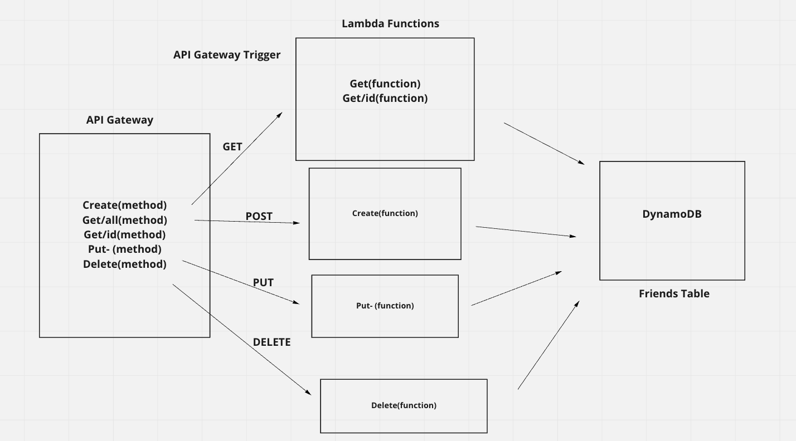
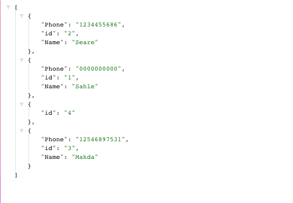

# Lab: AWS: API, Dynamo and Lambda

Overview
Create a serverless REST API

## Feature Tasks & Requirements

Create a single resource REST API using a domain model of your choosing, constructed using AWS Cloud Services

- Database: DynamoDB
  - 1 Table required
- Routing: API Gateway
  - POST
  - /people - Given a JSON body, inserts a record into the database
  - returns an object representing one record, by its id (##)
  - GET
    - /people - returns an array of objects representing the records in the database
    - /people/## - returns an object representing one record, by its id (##)
  - PUT
    - /people/## - Given a JSON body and an ID (##), updates a record in the database
    - returns an object representing one record, by its id (##)
  - DELETE
    - /people/## - Given an id (##) removes the matching record from the database
    - returns an empty object
- CRUD Operation Handlers: Lambda Functions

## [PR](https://github.com/SarahTek/serverless-api/pull/5)
## UML

### API Link
- [deployement](https://s8v5zr44ke.execute-api.us-east-1.amazonaws.com/deploy/people)

### Documentaion

What is the root URL to your API?

What are the routes?

- Get - people- gets all the friends in the friend table
- Get/id - /people/id- gets one friend with the id from the table
- Post - /people - creates a new friens to the table
- Put - /people/id- finds one friend with the id from the table and updates the information
- Delete - /people/id- finds and delete a friend from the table using 'id' and returns the deleted friend from the table with a success message.

What inputs do they require?

- it require the event.pathParameters

What output do they return?

- it return the people from the table according to the CRUD method. GET will return all people from the table. PUt will update it and delete will delete the people in the table.
